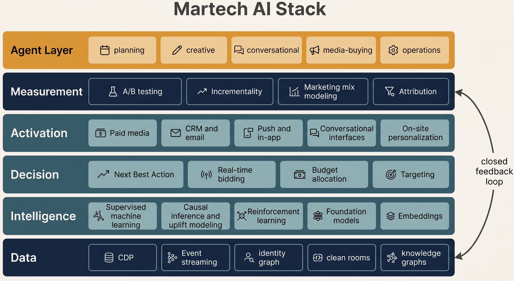

<div align="center">

# Awesome Martech AI

[](https://awesome.re)

A curated list of AI/ML systems powering modern marketing technology — causal experimentation, user intelligence, ad systems, growth engines, conversational agents, and the emerging Agent-to-Agent marketing paradigm.

<br>



</div>

<br>

## Contents

**Part I — The Martech AI Stack**

- [Introduction](#introduction)
- [Stack Map and Design Approach](#stack-map-and-design-approach)
- [Data Layer](#data-layer)
- [Intelligence Layer](#intelligence-layer)
- [Decision Layer](#decision-layer)
- [Activation Layer](#activation-layer)
- [Measurement Layer](#measurement-layer)
- [Platforms and MLOps](#platforms-and-mlops)

**Part II — The Agent Era**

- [Four Tiers of Marketing Agents](#four-tiers-of-marketing-agents)
- [Conversational and Service Agents](#conversational-and-service-agents)
- [LLM Agent Leverage Points](#llm-agent-leverage-points)
- [Agent-Building Frameworks](#agent-building-frameworks)
- [Frontier (2025/2026)](#frontier-20252026)

**Part III — Applied and References**

- [Industry Playbooks](#industry-playbooks)
- [Original Research and Notes](#original-research-and-notes)
- [Books](#books)
- [Research Papers](#research-papers)
- [Community and Conferences](#community-and-conferences)
- [Related Lists](#related-lists)
- [Contributing](#contributing)

---

# Part I — The Martech AI Stack

## Introduction

Marketing technology (Martech) has gone through three eras:

1. **Rule era (pre-2015):** Segmentation by SQL, journeys by if/then, attribution by last-click.
2. **ML era (2015–2023):** Supervised learning for CTR/CVR/LTV, multi-armed bandits for creative, uplift modeling for treatment effects, RL for bidding and budget allocation.
3. **Agent era (2024–):** LLM-powered systems that plan, generate, decide, and act across the marketing stack — from creative production to autonomous media buying to conversational selling.

This repository organizes the field into three parts:

- **Part I — The Stack.** Six horizontal layers, from Data to Platforms, with the methods and tools that live in each.
- **Part II — The Agent Era.** A vertical layer cutting across the stack: marketing agents in production, the four-tier framework that distinguishes them, and where LLM reasoning has structural leverage.
- **Part III — Applied and References.** Industry playbooks, original research, books, papers, and community resources.

Entry selection prioritizes deployed systems with disclosed traction, peer-reviewed or production-engineering published work, and material that substantively reframes how practitioners approach a problem.

This list is the marketing-side companion to [awesome-quant-ai](https://github.com/leoncuhk/awesome-quant-ai) and [recsys-papers](https://github.com/leoncuhk/recsys-papers).

## Stack Map and Design Approach

### The Stack

```
┌──────────────────────────────────────────────────────────────────────┐
│                       Agent Layer (cross-cutting)                    │
│       planning · creative · conversational · media-buying · ops      │
└──────────────────────────────────────────────────────────────────────┘
┌──────────────────────────────────────────────────────────────────────┐
│   Measurement   ←  A/B · Incrementality · MMM · Attribution          │
│   Activation    ←  Paid media · CRM · Push · Conversational · Site   │
│   Decision      ←  NBA · RTB · Allocation · Targeting                │
│   Intelligence  ←  ML · Causal · RL · Embeddings · Foundation Models │
│   Data          ←  CDP · Event stream · Identity graph · Clean room  │
└──────────────────────────────────────────────────────────────────────┘
┌──────────────────────────────────────────────────────────────────────┐
│  Platforms & MLOps (substrate):  Feature store · Experimentation     │
│                                  platform · ML platform · Governance │
└──────────────────────────────────────────────────────────────────────┘
```

The five core layers are connected by a closed feedback loop: data feeds intelligence, intelligence informs decisions, decisions drive activation, activation produces outcomes, outcomes are measured, and measurement returns training data to intelligence. Platforms and MLOps sit underneath as the substrate. The Agent layer sits on top as a new orchestration tier that lets natural-language goals drive behavior across all five.

### Cross-Layer Domain Views

Three terms recur in marketing-AI literature — **User Intelligence**, **Advertising Systems**, **Growth Engine** — that are not stack layers. They are **domains that cut across multiple layers**. Naming which layers each domain touches resolves much of the apparent ambiguity in the field:

| Domain | Data | Intelligence | Decision | Activation | Measurement |
|---|:---:|:---:|:---:|:---:|:---:|
| User Intelligence | ● | ● | ● |  |  |
| Advertising Systems |  | ● | ● | ● |  |
| Growth Engine |  | ◐ | ● | ● | ● |

- **User Intelligence** — builds the system's model of the user. Lives in Data (CDP, identity), Intelligence (LTV, propensity, embeddings), and Decision (audience selection). Recommender systems are a heavy sub-area; see [recsys-papers](https://github.com/leoncuhk/recsys-papers).
- **Advertising Systems** — buys impressions in front of users. Lives in Intelligence (ranking models such as DIN, DLRM), Decision (RTB bidding, pacing), and Activation (creative production and delivery).
- **Growth Engine** — orchestrates actions to lift business metrics. Lives in Decision (NBA, budget allocation), Activation (channel orchestration), and Measurement (closed-loop experimentation). Often draws on the Intelligence layer (propensity, uplift) without owning it.

A single technique — uplift modeling, for example — can appear under any of the three depending on the question being asked: targeting which users (User Intelligence), which creative (Advertising Systems), or which promotional action (Growth Engine). When the domain term is ambiguous, the resolving question is *which layer the decision lives in*, not which technique is used.

The rest of Part I is organized by layer rather than by domain.

### Design Approach

A defensible Martech AI system is built around the loop, not around a model:

1. **Define the growth objective.** Pick one north-star outcome (revenue, retained user months, qualified pipeline). Define guardrail metrics (margin, NPS, brand). Without this, optimization corrupts.
2. **Identify the decision surface.** What is the system actually choosing? An audience, a creative, a bid, a message, a timing, a channel mix? The decision determines the method.
3. **Pick the right method for the decision type.** Prediction (supervised) ≠ causation (uplift / DiD / synthetic control) ≠ sequential decision (bandits / RL) ≠ generation (LLM). Mismatched methods are a recurring cause of failed projects.
4. **Establish a measurement regime first.** Holdouts, geo-experiments, switchback, MMM — pick one before launching, not after.
5. **Build the data contract.** Identity resolution, event taxonomy, consent state. The model is downstream of the data contract.
6. **Ship the minimum closed loop.** End-to-end coverage beats partial-and-beautiful. A working bandit on three creatives is more valuable than a perfect CTR model with no activation.
7. **Iterate on the bottleneck layer.** Most Martech systems stall at a specific layer (often decision or measurement, rarely modeling). Diagnose before adding complexity.
8. **Govern the agent.** When LLM agents enter the loop, the constraint is bounded autonomy rather than raw accuracy. Define what the agent may decide, what requires human review, and what is forbidden.

### Paradigm Comparison

| Paradigm | Decision type | Data appetite | Latency | Where it fits |
|---|---|---|---|---|
| Rule engines | Boolean / threshold | Low | Microseconds | Compliance, hard guardrails |
| Supervised ML | Prediction | High | ~10–100 ms | CTR/CVR/LTV, propensity |
| Causal / Uplift | Counterfactual | Medium (experiment data) | Offline | Treatment targeting, incrementality |
| Multi-armed bandits | Exploration vs exploitation | Medium | ~ms | Creative, headlines, subject lines |
| Reinforcement Learning | Sequential policy | High + simulator | ms–s | Bidding, pacing, NBA |
| LLM Agents | Open-ended reasoning + tool use | Low (with retrieval) | s–min | Strategy, creative chains, conversation, Agent-to-Agent |

Matching the paradigm to the decision type — prediction vs counterfactual vs sequential vs open-ended — is a recurring source of project success or failure.

## Data Layer

The data substrate that everything else stands on: customer events, identity resolution, consent state, and privacy-preserving joins with external data.

### Customer Data Platforms

- [Segment](https://segment.com/) — The reference commercial CDP; event collection and downstream routing.
- [RudderStack](https://www.rudderstack.com/) — Open-source CDP with warehouse-native architecture.
- [Hightouch](https://hightouch.com/) — Reverse ETL from warehouse to activation tools; the composable-CDP pattern.
- [Census](https://www.getcensus.com/) — Reverse ETL alternative to Hightouch.

### Identity and Event Schema

- [Snowplow](https://snowplow.io/) — Open-source behavioral data pipeline; explicit event schemas.
- Identity graphs and resolution are typically built on top of CDP outputs; vendor offerings include LiveRamp, Adobe RTCDP, and the warehouse-native pattern (BigQuery / Snowflake) with deterministic + probabilistic matching.

### Clean Rooms and Privacy

- [Google Ads Data Hub](https://www.thinkwithgoogle.com/products/ads-data-hub/) — Privacy-preserving query layer over Google's first-party data.
- [AWS Clean Rooms](https://aws.amazon.com/clean-rooms/) — Cross-party data collaboration without raw data sharing.
- [Snowflake Data Clean Rooms](https://www.snowflake.com/en/data-cloud/workloads/data-clean-room/) — Native clean-room workloads inside the Snowflake warehouse.

## Intelligence Layer

The modeling layer: predictive ML, causal inference, reinforcement learning, embeddings, and foundation models. This is where the marketing system's beliefs about users, items, and outcomes are produced.

### Machine Learning Foundations

- [Pattern Recognition and Machine Learning](https://www.microsoft.com/en-us/research/people/cmbishop/prml-book/) by Christopher Bishop — Reference for probabilistic ML used in ranking, CTR, and propensity models.
- [The Elements of Statistical Learning](https://hastie.su.domains/ElemStatLearn/) by Hastie, Tibshirani, Friedman — Free PDF; tree ensembles and regularization used heavily in marketing ML.
- [Deep Learning](https://www.deeplearningbook.org/) by Goodfellow, Bengio, Courville — The reference text for deep architectures behind modern ad ranking and embeddings.

### Causal Inference and Uplift

The discipline that separates Martech AI from generic ML: marketing decisions are interventions, not predictions.

- [Causal Inference: The Mixtape](https://mixtape.scunning.com/) by Scott Cunningham — Free book; DiD, IV, RDD, synthetic control with applied code.
- [Causal Inference for The Brave and True](https://matheusfacure.github.io/python-causality-handbook/) by Matheus Facure — Python-first applied causal inference textbook.
- [Trustworthy Online Controlled Experiments](https://experimentguide.com/) by Kohavi, Tang, Xu — The Microsoft/LinkedIn/Booking playbook for A/B testing at scale.
- [CausalML](https://github.com/uber/causalml) by Uber — Uplift trees, meta-learners (S/T/X/R), production-grade.
- [EconML](https://github.com/py-why/EconML) by Microsoft — Double ML, DR-learner, heterogeneous treatment effects.
- [DoWhy](https://github.com/py-why/dowhy) — Causal effect estimation framework with explicit assumption modeling.
- [Uplift Modeling for Multiple Treatments](https://arxiv.org/abs/1908.05372) — The X-learner and CMU extensions used in CRM targeting.

### Reinforcement Learning

- [Reinforcement Learning: An Introduction](http://incompleteideas.net/book/the-book-2nd.html) by Sutton & Barto — Free PDF; baseline for bandits, contextual bandits, and policy learning used in bidding and NBA.
- [Spinning Up in Deep RL](https://spinningup.openai.com/) by OpenAI — Practical PPO/SAC/DDPG, the algorithms inside modern bidding agents.

### User Modeling

LTV, propensity, segmentation, embeddings — the user representations that feed Decision-layer choices.

- [PyMC-Marketing](https://github.com/pymc-labs/pymc-marketing) — Bayesian CLV (BG/NBD, Gamma-Gamma) and MMM, production-ready.
- [Lifetimes](https://github.com/CamDavidsonPilon/lifetimes) by Cam Davidson-Pilon — Canonical Python library for non-contractual CLV.
- [pLTV at Meta](https://research.facebook.com/blog/2022/10/predicting-lifetime-value-of-ad-customers/) — Predictive LTV in ad systems.
- [USE: Universal Sentence Encoder](https://tfhub.dev/google/universal-sentence-encoder/4) — Baseline for user/content embeddings.
- [Two-Tower Models for Retrieval](https://research.google/pubs/sampling-bias-corrected-neural-modeling-for-large-corpus-item-recommendations/) — The architecture behind YouTube and most modern CDP-side retrieval.

### Ranking and Retrieval

The models that score and rank impressions, items, and audiences. Recommender-system models overlap heavily with marketing ranking; see [recsys-papers](https://github.com/leoncuhk/recsys-papers) for the full literature.

- [Deep Interest Network (DIN)](https://arxiv.org/abs/1706.06978) — Alibaba's attention-based CTR model, deployed in production at scale.
- [DIEN](https://arxiv.org/abs/1809.03672) — Sequential extension of DIN.
- [DLRM](https://arxiv.org/abs/1906.00091) — Meta's open-source deep learning recommendation model.
- [DCN-V2](https://arxiv.org/abs/2008.13535) — Deep & Cross Network v2 for feature crosses.

### Foundation Models for Marketing

Pretrained models applied to tabular CDP data, customer sequences, and creative generation. Early but accelerating.

- [TabPFN](https://github.com/PriorLabs/TabPFN) — Foundation model for small-to-mid tabular datasets.
- [SASRec](https://arxiv.org/abs/1808.09781), [BERT4Rec](https://arxiv.org/abs/1904.06690) — Transformer architectures for user-sequence modeling, generalizing toward CDP event streams.

## Decision Layer

Given a user model and an inventory, which action does the system take? Bid amount, audience, creative, channel, message, timing.

### Bidding and Pacing

- [Real-Time Bidding by Reinforcement Learning in Display Advertising](https://arxiv.org/abs/1701.02490) — Foundational RL-for-bidding paper from Alibaba.
- [Multi-Constraint Online Allocation for Display Advertising](https://research.google/pubs/online-allocation-and-pricing-with-economies-of-scale/) — Google's approach to pacing and constrained allocation.
- [Bid Shading in First-Price Auctions](https://research.criteo.com/) — Criteo and Adobe research on the post-header-bidding shift.

### Next Best Action

- [Next Best Action Marketing at Pega](https://www.pega.com/products/customer-decision-hub) — Reference architecture for enterprise NBA.
- [Contextual Bandits at Netflix](https://research.netflix.com/research-area/recommendations) — Artwork personalization, a widely-cited bandit case in production.
- [Reinforcement Learning for Personalization at Uber](https://www.uber.com/blog/categories/data-machine-learning/) — Uber's NBA system blog series.

### Budget and Audience Allocation

Allocation typically derives jointly from MMM (see Measurement) and uplift targeting (see Intelligence). Tooling listed here covers the optimization step.

- [Robyn](https://facebookexperimental.github.io/Robyn/) — Meta open-source MMM with budget optimizer.
- [LightweightMMM](https://github.com/google/lightweight_mmm) — Google's Bayesian MMM for budget reallocation.

## Activation Layer

The channels and surfaces through which decisions reach users: paid media, CRM, push, on-site, and increasingly conversational. The autonomous decisioning *inside* the major paid surfaces is covered in Part II as Tier 1; the programmatic infrastructure connecting publishers to advertisers is Tier 4.

### Paid Media Surfaces

The major buying surfaces are Google Ads, Meta Ads, Amazon Ads, TikTok Ads, retail-media networks (Walmart, Target, Instacart), and the open programmatic ecosystem (DSPs, SSPs, exchanges). Each ships with built-in automated decisioning. See [Four Tiers of Marketing Agents](#four-tiers-of-marketing-agents) for the agent-class treatment.

### CRM and Lifecycle Messaging

- [Iterable](https://iterable.com/) — Programmable channel orchestration; reference platform for lifecycle messaging.
- [Braze](https://www.braze.com/products/sage-ai) — Sage AI for journey optimization.
- [Customer.io](https://customer.io/) — Developer-friendly lifecycle messaging.
- [OneSignal](https://onesignal.com/) — Push and in-app messaging.

### Creative Production and DCO

- [Multi-Armed Bandits for Creative Optimization](https://research.facebook.com/publications/bandit-optimization/) — Meta's approach to creative testing at scale.
- [Dynamic Creative Optimization](https://www.thinkwithgoogle.com/marketing-strategies/automation/dynamic-creative-optimization/) — Google's framework for combinatorial creative.

## Measurement Layer

How the system knows whether activation worked: experimentation, incrementality, MMM, attribution. The measurement regime determines what can be learned and therefore what can be optimized.

### Experimentation Platforms

- [GrowthBook](https://github.com/growthbook/growthbook) — Open-source experimentation and feature flagging with Bayesian and frequentist engines.
- [Eppo](https://www.geteppo.com/) — Warehouse-native experimentation, used by Twitch and DraftKings.
- [Statsig](https://statsig.com/) — Feature flags and experiments, free tier for startups.
- [PlanOut](https://github.com/facebook/planout) by Meta — Origin assignment framework; still relevant for orthogonal experimental design.
- [Optimizely](https://www.optimizely.com/) — Long-running commercial experimentation platform.

### Switchback and Geo-Experiments

- [Switchback Experiments at Lyft](https://eng.lyft.com/experimentation-in-a-ridesharing-marketplace-b39db027a66e) — Marketplace-aware experimental design.
- [CausalImpact (Synthetic Control for Geo-Experiments)](https://research.google/pubs/inferring-causal-impact-using-bayesian-structural-time-series-models/) — Google's Bayesian structural time-series approach.

### Incrementality

- [Incrementality, Bidding, and Attribution](https://research.facebook.com/publications/incrementality-bidding-and-attribution/) — Meta's case for incrementality testing over multi-touch attribution.

### Marketing Mix Modeling

- [Robyn](https://facebookexperimental.github.io/Robyn/) — Meta, open-source automated MMM.
- [LightweightMMM](https://github.com/google/lightweight_mmm) — Google, Bayesian MMM.
- [PyMC-Marketing MMM](https://www.pymc-marketing.io/) — PyMC-Labs, Bayesian MMM with explicit priors.

### Attribution

Attribution is increasingly treated as a complement to — rather than substitute for — incrementality and MMM. The post-cookie environment has accelerated this shift.

## Platforms and MLOps

The substrate that runs across every layer above: feature stores, ML platforms, experimentation infrastructure, governance.

### Feature Stores

- [Feast](https://github.com/feast-dev/feast) — Open-source feature store; default in many marketing ML stacks.
- [Tecton](https://www.tecton.ai/) — Commercial feature platform with real-time path.

### ML Platforms

- [MLflow](https://github.com/mlflow/mlflow) — Open-source experiment tracking and model registry.
- [Weights & Biases](https://wandb.ai/) — Commercial experiment tracking, evaluation, and observability.

### Governance

Data governance, model governance, and consent state management increasingly form a distinct sub-discipline as regulators tighten and clean rooms become primary measurement substrate. Tooling is fragmented; the operational pattern is typically a combination of warehouse-native controls (BigQuery / Snowflake) and a dedicated consent platform (OneTrust, Sourcepoint, Didomi).

---

# Part II — The Agent Era

The new vertical layer that cuts across the Stack: marketing agents in production, the four tiers that distinguish them, and the points where LLM reasoning is structurally advantaged.

## Four Tiers of Marketing Agents

Marketing agents in 2025–2026 fall into four operationally distinct classes. Distinguishing them clarifies what each system does, who its customer is, and how it makes money. A long-form treatment is in [`think/three-tier-marketing-agents.md`](think/three-tier-marketing-agents.md).

### Tier 1 — Platform-Native AI

Autonomous bidding, creative assembly, audience discovery, and budget pacing built into the major ad-buying surfaces. Operates as autonomous ML rather than as an LLM-driven agent product, and manages a majority of global digital ad spend.

- [Google Performance Max / Smart Bidding](https://ads.google.com/home/campaigns/performance-max/) — Cross-channel automated campaign type; the de facto agent inside Google Ads.
- [Meta Advantage+](https://www.facebook.com/business/ads/advantage-plus) — Automated audience, creative, and placement decisions across Meta surfaces.
- [Amazon Sponsored Brands / DSP Automated Bidding](https://advertising.amazon.com/) — Amazon's equivalent on retail media.
- [TikTok Smart+](https://ads.tiktok.com/business/en-US/blog/smart-plus-ai-powered-ad-solution) — TikTok's answer to PMax/Advantage+.

### Tier 2 — Vertical Agent Products

Independent agent products sold to brands and agencies, with disclosed scale, customers, or revenue.

- [Albert.ai](https://albert.ai/) — One of the earliest autonomous ad agents (originally Adgorithms). Cross-channel management across Google, Meta, and YouTube. Disclosed case study: Harley-Davidson reported 5× traffic and a 2,930% monthly lead lift after deployment.
- [Ryze AI](https://ryze.ai/) — Disclosed scale of $500M+ ad spend managed across 2,000+ marketers in 23 countries, covering Google, Meta, Microsoft, LinkedIn, TikTok, Pinterest, and Amazon PPC. Reported customer outcome: 3.8× ROAS within 6 weeks.
- [Muze AI](https://muzeai.com/) — YC-backed; positioned to replace $10K–$15K/month agency retainers. 85–90% autonomous; video and image generation in under 2 minutes; auto-detects creative fatigue. On the Shopify App Store with paying customers, still early.
- [Jellyfish](https://www.jellyfish.com/) — Agency that replaced parts of its human media-buying team with AI bots. 65% reduction in campaign launch time. Drove 80% faster content delivery and 30% cost reduction for M&S.

### Tier 3 — YC 2026 Cohort (Early-Stage)

LLM-native entrants from the YC 2026 batch. Approaches are differentiated; outcomes are not yet validated at scale.

- [Uplane](https://www.ycombinator.com/companies/uplane) — Replaces marketing agencies; generates hundreds of ad creatives with matching landing pages, connects to CRM and ERP to learn what drives profit, not just clicks.
- [Lapis](https://www.ycombinator.com/companies/lapis) — Native ad placement inside ChatGPT (a new channel), generating creative from existing brand assets across ChatGPT, Meta, and Google.
- [sitefire](https://www.ycombinator.com/companies/sitefire) — *Agent SEO*: helps brands get discovered and recommended by AI agents. Buying placement in front of AI agents, not humans.
- [Absurd](https://www.ycombinator.com/companies/absurd) — Full-stack AI video advertising. Kalshi's "Election Day" spot exceeded a million views.

### Tier 4 — Programmatic Infrastructure

Autonomous ML systems operating inside the programmatic supply chain, serving publishers and ad networks rather than brand advertisers directly. Targeting, bidding, and creative selection are run at platform scale; the customer relationship is structured as a take-rate on ad spend rather than as a SaaS product.

- [AppLovin (AXON 2.0)](https://www.applovin.com/axon/) — Autonomous ML targeting and bidding inside AppLovin's owned mobile ad network. AXON 2.0 shipped in 2023 and is associated with AppLovin's subsequent revenue and market-cap re-rating.
- [Mobvista / Mintegral](https://www.mobvista.com/) — HK-listed; programmatic ad network with global SSP/DSP infrastructure, strong in Chinese mobile-app outbound.
- [Tencent Ads (腾讯广告)](https://e.qq.com/) — Autonomous ranking and bidding inside the Tencent superapp surface (WeChat, video, news, games).
- [Alibaba Mama (阿里妈妈)](https://www.alimama.com/) — The same pattern inside Alibaba's e-commerce ad surface.
- [The Trade Desk](https://www.thetradedesk.com/) — The dominant independent DSP outside walled gardens.
- [Criteo](https://www.criteo.com/) — Long-running retargeting DSP, still a meaningful programmatic player.

Economic characteristics: revenue scales with the volume of ad spend passing through the platform; the matching algorithm and first-party data are co-located; two-sided network effects between publishers and advertisers reinforce position. See [`think/three-tier-marketing-agents.md`](think/three-tier-marketing-agents.md) for the four-tier framework, the buyer-side vs supply-side 2×2 map, and the Chinese-vs-US ecosystem comparison.

## Conversational and Service Agents

The marketing funnel does not end at click — increasingly the conversation is the funnel. Conversational agents straddle the Activation and Decision layers in the Stack, but as a product category they belong here in Part II because their differentiator is autonomous reasoning, not channel mechanics.

- [Sierra](https://sierra.ai/) — Conversational AI for customer service. Reached $100M ARR within 7 quarters of founding; co-founded by Bret Taylor (ex-Salesforce CEO).
- [Decagon](https://decagon.ai/) — AI agents for customer support; significant traction in fintech and consumer brands.
- [Parloa](https://www.parloa.com/) — European conversational AI for contact centers.
- [Cresta](https://cresta.com/) — Real-time agent assist and autonomous agents for sales and support conversations.
- [Ada](https://www.ada.cx/) — Customer service automation; one of the earliest LLM-native pivots in the category.

## LLM Agent Leverage Points

Most of the systems in Tiers 1, 2, and 4 are built on traditional ML — gradient boosting, multi-armed bandits, RL bidders — with LLMs limited to creative generation. The loop they optimize is high-frequency, low-latency, and data-dense, which favors classical ML over LLM reasoning. Three areas remain where LLM reasoning is structurally advantaged:

1. **Strategy layer.** Channel mix, market-entry decisions, brand positioning, budget allocation across portfolios. These require business-context reasoning rather than per-impression optimization.
2. **End-to-end creative chain.** Market insight → creative strategy → copy/visual/video generation → A/B reading → iterative refinement, run coherently as a single loop rather than as isolated generation steps.
3. **Agent-to-Agent marketing.** Making products legible and recommendable to AI buying agents (ChatGPT, Claude, vertical purchase assistants) as those agents intermediate more consumer decisions. The category is new and largely empty; see Frontier section below.

## Agent-Building Frameworks

- [LangGraph](https://github.com/langchain-ai/langgraph) — Graph-based agent orchestration; common substrate for multi-step marketing agents.
- [Claude Agent SDK](https://docs.anthropic.com/en/docs/agents-and-tools/agent-sdk) — Anthropic's SDK for building tool-using agents; well-suited to strategy reasoning and creative chains.
- [OpenAI Assistants and Responses API](https://platform.openai.com/docs/assistants/overview) — Default for prototyping marketing agents on the GPT stack.
- [CrewAI](https://github.com/crewAIInc/crewAI) — Multi-agent role-based orchestration framework.

## Frontier (2025/2026)

### Agent-to-Agent Marketing

A new layer in which the audience of an ad is another AI agent acting on behalf of a user (ChatGPT, Claude, Perplexity, vertical buying agents). This reshapes SEO, comparison shopping, and recommendation. Early signals: sitefire (Agent SEO), Lapis (ChatGPT ad placement), schema and structured-data renaissance, agent-readable product catalogs.

### Privacy-First Measurement

Post-cookie, post-IDFA. The revival of MMM, incrementality testing, geo-experiments, and clean rooms. Tooling listed under the [Measurement Layer](#measurement-layer) and [Data Layer](#data-layer).

### Foundation Models on Tabular CDP Data

Pretrained transformers on event streams and customer behavior — early but accelerating. Watch TabPFN, customer-sequence models analogous to SASRec/BERT4Rec generalized to full CDP event data.

### AI4AI for Growth

LLM agents that write the experiments, generate the audiences, and propose the creative tests — automating the inner loop of growth itself. Most YC 2026 marketing-AI cohort entries are bets on some version of this thesis.

### Conversational Commerce as the Default UI

When the chat window becomes the storefront, the marketing surface is the conversation. Sierra, Decagon, and Cresta point at the service end; selling-side equivalents are forming now.

---

# Part III — Applied and References

## Industry Playbooks

Production case studies and engineering write-ups from companies running Martech AI at scale. Each entry tagged with the primary cross-layer domain it speaks to (UI = User Intelligence, AS = Advertising Systems, GE = Growth Engine).

- [Meta — Predicting Lifetime Value of Ad Customers](https://research.facebook.com/blog/2022/10/predicting-lifetime-value-of-ad-customers/) — pLTV in ad ranking. *[UI, AS]*
- [Alibaba — Deep Interest Network in Display Advertising](https://arxiv.org/abs/1706.06978) — The DIN family in production for years. *[AS]*
- [Tencent — Hierarchical Recommendation and Crowd Algorithms](https://www.atatech.org/) — Tencent's ad and growth stack. *[UI, AS]*
- [Uber Eats — Causal Inference for Pricing and Promotions](https://www.uber.com/blog/causal-inference-at-uber/) — Heterogeneous treatment effects in marketplace pricing. *[GE]*
- [LinkedIn — Experimentation Platform and Causal Methods](https://engineering.linkedin.com/blog/topic/a-b-testing) — LinkedIn's experimentation engineering blog. *[GE]*
- [Meituan — User Growth System](https://tech.meituan.com/) — NBA, ranking, and growth experimentation. *[UI, GE]*
- [Beike (KE Holdings) — Intelligent Advertising](https://www.ke.com/) — Real-estate-vertical ad optimization. *[AS]*
- [NIO — Agent and Decision Intelligence in Auto Retail](https://www.nio.com/) — Agent and decision-intelligence stack for automotive marketing. *[GE]*

## Original Research and Notes

Long-form analyses written for this repository.

- [Three Tiers of Marketing Agents — and the Fourth Player Most Frameworks Miss](think/three-tier-marketing-agents.md) — The four-tier framework, the buyer-side vs supply-side 2×2 map, why programmatic infrastructure is the most profitable layer, and the Chinese-vs-US ecosystem asymmetry.

## Books

- [Trustworthy Online Controlled Experiments](https://experimentguide.com/) by Kohavi, Tang, Xu — Reference text for A/B testing at scale.
- [Lean Analytics](https://leananalyticsbook.com/) by Croll & Yoskovitz — The growth-funnel framing that still informs modern NBA.
- [Hooked](https://www.nirandfar.com/hooked/) by Nir Eyal — Behavioral mechanics behind retention and lifecycle design.
- [The Mom Test](http://momtestbook.com/) by Rob Fitzpatrick — How to learn what marketing should actually optimize for.
- [Marketing Metrics](https://www.marketingmetricsbook.com/) — Canonical reference for metric definitions.

## Research Papers

### Foundational

- [Causal Inference and Stable Unit Treatment Value Assumption](https://www.jstor.org/stable/2289064) — Rubin's foundational potential outcomes paper.
- [The Predictron](https://arxiv.org/abs/1612.08810) — DeepMind on end-to-end value prediction, relevant for pacing.

### Recommender Systems

See [leoncuhk/recsys-papers](https://github.com/leoncuhk/recsys-papers) for a maintained list covering retrieval, ranking, sequential, and LLM-based recommendation.

### Ad Systems

- [Deep Interest Network](https://arxiv.org/abs/1706.06978), [DIEN](https://arxiv.org/abs/1809.03672), [DLRM](https://arxiv.org/abs/1906.00091), [DCN-V2](https://arxiv.org/abs/2008.13535).

### LLM Agents for Marketing (emerging)

- [Generative Agents: Interactive Simulacra of Human Behavior](https://arxiv.org/abs/2304.03442) — Substrate for several conversational-marketing agents.
- [AgentBench](https://arxiv.org/abs/2308.03688) — Benchmarking agent capabilities; useful for agent evaluation in marketing tasks.

## Community and Conferences

### Communities

- [r/marketing](https://www.reddit.com/r/marketing/), [r/AdOps](https://www.reddit.com/r/adops/), [r/GrowthHacking](https://www.reddit.com/r/GrowthHacking/) — Reddit communities.
- [MeasureCamp](https://www.measurecamp.org/) — Unconference for measurement and experimentation practitioners.
- [Locally Optimistic](https://locallyoptimistic.com/) — Data and analytics community with strong Martech presence.

### Conferences

- [The MarTech Conference](https://martechconf.com/), [Lifecycle Marketing Summit](https://www.iterable.com/activate/), [Affiliate Summit](https://www.affiliatesummit.com/), [KDD Workshop on AI for Online Advertising](https://www.kdd.org/).

## Related Lists

- [awesome-quant-ai](https://github.com/leoncuhk/awesome-quant-ai) — Companion list for quantitative investment AI.
- [recsys-papers](https://github.com/leoncuhk/recsys-papers) — Recommender systems literature.
- [awesome-causal-inference](https://github.com/matheusfacure/awesome-causal-inference) — Causal inference resources.
- [awesome-llm-apps](https://github.com/Shubhamsaboo/awesome-llm-apps) — General LLM app patterns; some relevant to agent design.

## Contributing

Contributions are welcome. This list is **curated, not comprehensive** — additions should clear the bar set by existing entries: shipped at scale, published research, or a perspective that changes how a practitioner should think.

- Prefer open source, published work, or systems with disclosed traction.
- Disclose affiliation if you built it.
- One PR per resource; format: `- [Name](url) — One-sentence description ending with a period.`

See [CONTRIBUTING.md](CONTRIBUTING.md) for the full guidelines.

---

<div align="center">

If you find this project useful, please consider giving it a star.

</div>
